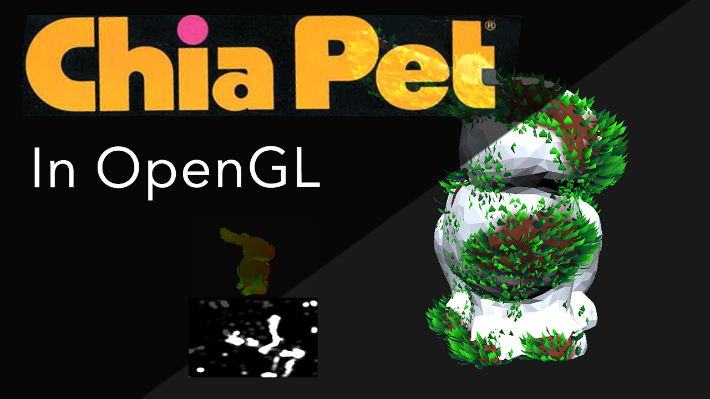

## Chia
For more information, see the readme in [part1](./part1/).
## [Video Rundown](https://youtu.be/kVwgti5Q0po)

* Name and partners name(At most teams of 2 folks total)
  * Team member 1: Ezekiel D'Ascoli
* How many hours did it take you to complete this final project? 
  * 20? 40? Oh god who knows, I stopped counting after the walls grew faces. Likely around 16-20.
* Did you collaborate or share ideas with any other students/TAs/Professors? 
  * Nope
* Did you use any external resources? 
  * A few, they are listed at [part1](./part1/).

### Rubric

<table>
  <tbody>
    <tr>
      <th>Points</th>
      <th align="center">Description</th>
    </tr>
    <tr>
      <td>(33.3%) Project Completion</td>
     <td align="left"><ul><li>Does the project compile and run.</li><li>Is it polished without any bugs (No weird visual artifacts).</li><li>Did you make a video?</li><li>Did you add a screenshot of your project to the repository?</li></ul></td>
    </tr>
    <tr>
      <td>(33.3%) Technical</td>
      <td align="left"><ul><li>Was the implementation of the project challenging?</li><li>Even if you followed a tutoral, it should not be trivial, and have some personal touch to it.</li><li>Did you have to organize/process a sufficient amount of data?</li><li>Was it clear you consulted some outside resources that go above and beyond the scope of this class</li></ul></td>
    </tr>
    <tr>
      <td>(33.4%) Creativity</td>
      <td align="left"><ul><li>How visually appealing is the scene?<ul><li>Note: There should be some 'wow' factor--instructors discretion is used here.</li></ul></li><li>How original is the project<ul><li>Again, did you enhance a tutorial and do something unique or just go by the book?</li></ul></li></ul></td>
    </tr>
  </tbody>
</table>
