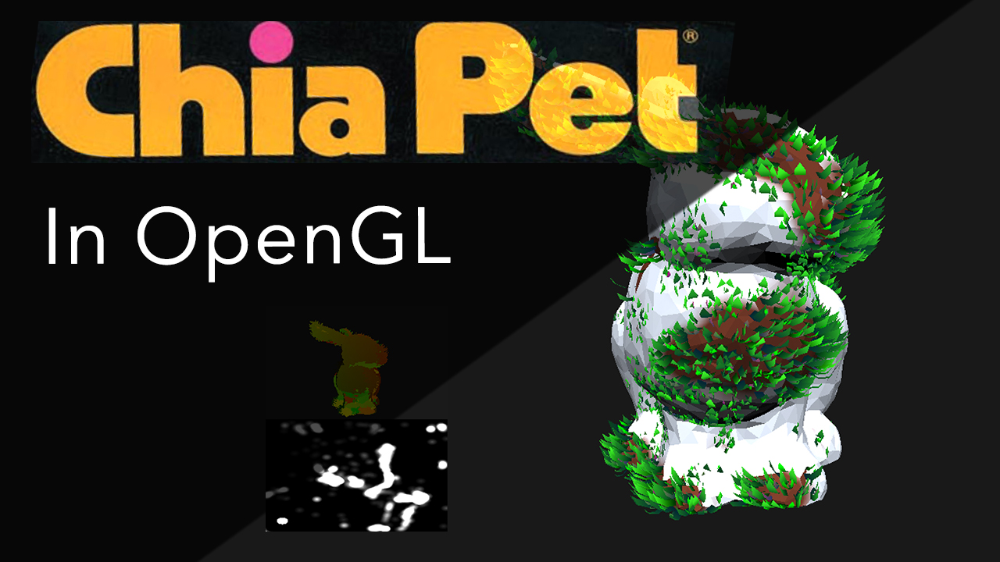

# Final Project - Computer Graphics



# Chia
## Convert triangulated, textured wavefronts into your very own Chia Pets.

## Video Rundown
[YouTube](https://youtu.be/kVwgti5Q0po)


## Usage
To run the program, you can clone the source, change into the "part1" directory, and then build using:
```
python3 build.py
```
This should be platform agnostic.
This will output the executable to that directory as "chia".
`chia` takes model paths as command line arguments and will load models in as chia pets.
eg:
```
./chia ../common/objects/texbun.obj
````

Technically, `chia` supports loading multiple models, but painting has not been debugged for them yet, as the textures are not rebound.
eg:
```
./chia ../common/objects/windmill/windmill.obj ../common/objects/texbun.obj
````
would load `windmill` as the first object and `texbun` as the second.
By default, the model shown at launch will be the first object.
You can switch between objects with the number keys (pressing `2` would switch to `texbun`).
You can toggle wireframe mode with `w`.

## Features
- Mousing over the model paints grass onto it!
  - Grass animates based on time painted at that position
  - Grass grows upwards
  - Three kinds of grass blades grow (currently light green, dark green, and purple)
  - Blade color determined by custom noise function based on vertice position
- Debug views
  - Texture Coordinates
  - Painting texture

## Found Resources
- [Roystan's Grass Shader tutorial](https://roystan.net/articles/grass-shader)
  - (aimed at Unity, so some assembly required)
  - This was my main resource for figuring out the basic ideas behind grass generation.
- [Ohio State Graphics Assignment from 2017](https://web.cse.ohio-state.edu/~crawfis.3/cse5542/Homework/Lab2/Lab2-3DPaint.html)
  - This link is probably the most helpful thing I found, but it didn't describe at all how to actually do the nuts-and-bolts of anything. 
    This gave me a good overall idea of what I needed to accomplish, and I found myself accidentally reinventing stuff this assignment asked of the students without knowing how to do it.
- [OpenGL Render-To-Texture Tutorial](https://www.opengl-tutorial.org/intermediate-tutorials/tutorial-14-render-to-texture/)
  - This was insanely helpful at figuring out how framebuffers work and how to contort them to my specific needs.
- [stackoverflow: How To Paint on 3D Models](https://computergraphics.stackexchange.com/questions/10231/how-to-paint-onto-3d-models)
  - This resource got me sort of on the right-ish path. I originally thought I would use projected textures to map my painted texture onto the object, but eventually moved away in favor of a Texture holding the texture coordinates of each fragment.

    
    
## TODOS
Some simple quality-of-life features I would like to add in the future:
- Conditionally show the debug views (debug views in lower left)
- Add object / camera motion controls
- Add color pickers for the grass / model
- Conditionally paint / unpaint so it isnt always painting and so you could maybe "mow" the grass down
